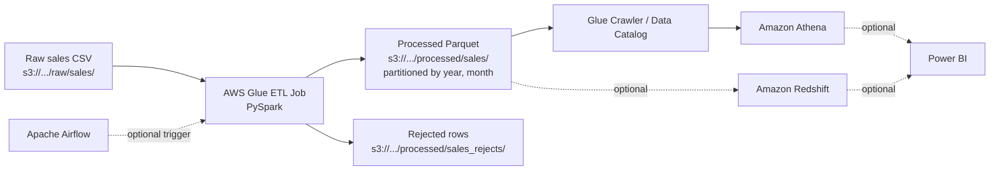

# AWS Glue PySpark Sales ETL Pipeline

A serverless ETL job built with **AWS Glue and PySpark** that ingests raw sales CSV files from Amazon S3, validates and cleans them, derives sales metrics, and writes analytics-ready **partitioned Parquet** back to S3. Invalid records are routed to a quarantine location with a rejection reason instead of being dropped silently.


## Features

- **Schema validation**: fails fast if required columns are missing, instead of "succeeding" on uncleaned data.
- **Deterministic parsing**: all columns are read as strings (no `inferSchema`) and cast explicitly.
- **Safe money handling**: strips currency symbols and thousand separators; stores amounts as `DECIMAL(18,2)`, not floating point.
- **Quarantine of bad rows**: invalid records are written to a separate reject path with `reject_reason` and the original row as JSON.
- **Derived metrics**: `total_amount`, `discount_amount`, `net_amount`, order year/month, cancelled flag.
- **Efficient output**: partitioned Parquet with dynamic partition overwrite, so reruns replace only the partitions being written.
- **Observability**: job metrics (raw, valid, dropped counts) are logged to CloudWatch.

---

## Architecture



Solid lines are implemented by the Glue job in this repository. Dashed lines are optional downstream integrations.

---

## Tech Stack

| Component | Role |
|---|---|
| Python 3 / PySpark | Transformation logic |
| AWS Glue 4.0+ | Serverless Spark execution |
| Amazon S3 | Raw, processed and reject storage |
| Glue Crawler / Data Catalog | Schema discovery and metadata |
| Amazon Athena | Ad hoc SQL over processed data |
| Amazon CloudWatch | Job logs and metrics |
| Amazon Redshift, Power BI, Apache Airflow | Optional downstream and orchestration |

---

## Repository Structure

```text
aws-glue-pyspark-sales-etl/
├── glue_sales_etl.py       # Glue job script
├── README.md
├── sample_data/
│   └── sales.csv
└── airflow/                # optional
    └── sales_etl_dag.py
```

---

## Input Data

CSV with a header row. Column names are normalized (trimmed, lowercased, spaces and hyphens replaced with underscores), so `OrderID` becomes `orderid`.

| Column | Required | Notes |
|---|:---:|---|
| `OrderID` | Yes | Order identifier |
| `OrderDate` | Yes | Format `yyyy-MM-dd` (configurable) |
| `Quantity` | Yes | Must be a positive integer |
| `UnitPrice` | Yes | Must be non-negative; currency symbols and commas tolerated |
| `CustomerName` | No | Defaults to `Unknown Customer` |
| `Product` | No | Defaults to `Unknown Product` |
| `Category` | No | Defaults to `Unknown Category` |
| `Discount` | No | Percentage by default; clamped to 0–100; defaults to 0 |
| `Status` | No | Defaults to `Unknown`; drives the cancelled flag |

Example:

```csv
OrderID,OrderDate,CustomerName,Product,Category,Quantity,UnitPrice,Discount,Status
1001,2026-01-05,John,Keyboard,Electronics,2,1500,10,Completed
1002,2026-01-06,David,Mouse,Electronics,3,500,5,Completed
1003,2026-01-07,,Monitor,Electronics,1,12000,0,Cancelled
```

---

## Output Data

**Valid records** (Parquet, partitioned by `order_year` and `order_month`):

| Column | Type | Description |
|---|---|---|
| source columns | cleaned | Trimmed, typed, defaults applied |
| `total_amount` | DECIMAL(18,2) | `quantity × unitprice` |
| `discount_amount` | DECIMAL(18,2) | `total_amount × discount / 100` |
| `net_amount` | DECIMAL(18,2) | `total_amount − discount_amount` |
| `order_year` | INT | Partition column |
| `order_month` | INT | Partition column |
| `order_month_name` | STRING | e.g. `January` |
| `is_cancelled` | INT | `1` if status is `cancelled` or `canceled` (case-insensitive), else `0` |

```text
s3://your-bucket/
├── raw/sales/sales.csv
├── processed/sales/
│   └── order_year=2026/order_month=1/part-*.parquet
└── processed/sales_rejects/
    └── part-*.parquet
```

**Rejected records** contain `reject_reason`, `raw_record` (JSON of the cleaned source row), `job_name` and `rejected_at`.

---

## Transformation Logic

1. **Read**: CSV from `SOURCE_PATH` with `multiLine`, quote and escape options enabled; all columns as strings.
2. **Standardize columns**: normalize names and verify required columns exist.
3. **Clean strings**: trim whitespace and convert blank strings to `NULL` in a single pass.
4. **Cast types**: date via `to_date`; quantity as integer; prices as `DECIMAL(18,2)`; discount clamped to 0–100.
5. **Deduplicate**: full-row by default, or on configured business keys.
6. **Validate and split**: rows failing validation go to the reject output with a reason.
7. **Default optional fields**: fill missing customer, product, category, status and discount.
8. **Derive metrics**: totals, discount, net amount, date parts and cancelled flag.
9. **Write**: repartition by year and month, then write partitioned Parquet.
10. **Log metrics**: raw, valid and dropped counts.

---

## Data Quality and Rejects

A row is rejected with the first matching reason:

| `reject_reason` | Condition |
|---|---|
| `missing_orderid` | `orderid` is null |
| `missing_or_invalid_orderdate` | Null, or not parseable with the configured format |
| `missing_or_invalid_quantity` | Null or non-numeric |
| `missing_or_invalid_unitprice` | Null or non-numeric |
| `non_positive_quantity` | `quantity <= 0` |
| `negative_unitprice` | `unitprice < 0` |

Duplicates are removed before validation and are not written to the reject output. The logged "dropped" metric includes both duplicates and rejected rows.

---

## Configuration

Constants at the top of the script:

| Setting | Default | Purpose |
|---|---|---|
| `REQUIRED_COLUMNS` | `orderid, orderdate, quantity, unitprice` | Columns that must exist |
| `DATE_FORMAT` | `yyyy-MM-dd` | Order date format |
| `DISCOUNT_IS_PERCENT` | `True` | Set `False` if discounts are fractions (`0.15`) |
| `DEDUP_KEYS` | `None` (full row) | Business keys for deduplication, e.g. `["orderid", "product"]` |

Glue job parameters:

| Parameter | Example |
|---|---|
| `--JOB_NAME` | `sales-pyspark-etl` |
| `--SOURCE_PATH` | `s3://your-bucket/raw/sales/` |
| `--TARGET_PATH` | `s3://your-bucket/processed/sales/` |

The reject path is derived automatically as `TARGET_PATH` (without trailing slash) + `_rejects/`.

---

## Deployment

**1. Upload the script**

```bash
aws s3 cp glue_sales_etl.py s3://your-bucket/scripts/glue_sales_etl.py
aws s3 cp sample_data/sales.csv s3://your-bucket/raw/sales/sales.csv
```

**2. Create the Glue job**

| Setting | Value |
|---|---|
| Type | Spark |
| Language | Python 3 |
| Glue version | 4.0 or later |
| Worker type | G.1X |
| Number of workers | 2 |
| Script path | `s3://your-bucket/scripts/glue_sales_etl.py` |

**3. Set job parameters** (see [Configuration](#configuration)) and run the job.

**4. IAM permissions** for the job role (least privilege):

- `s3:GetObject`, `s3:ListBucket` on the raw prefix
- `s3:PutObject`, `s3:DeleteObject`, `s3:ListBucket` on the processed and reject prefixes
- CloudWatch Logs write access
- Glue Data Catalog access if using the crawler or catalog tables

**5. Catalog the output**: run a Glue Crawler on the processed prefix to register the table (for example `sales_database.sales`).

---

## Querying with Athena

Monthly net sales:

```sql
SELECT order_year, order_month, SUM(net_amount) AS total_sales
FROM sales_database.sales
GROUP BY order_year, order_month
ORDER BY order_year, order_month;
```

Top 10 products by revenue (excluding cancelled orders):

```sql
SELECT product, SUM(net_amount) AS revenue
FROM sales_database.sales
WHERE is_cancelled = 0
GROUP BY product
ORDER BY revenue DESC
LIMIT 10;
```

Cancellation count:

```sql
SELECT COUNT(*) AS cancelled_orders
FROM sales_database.sales
WHERE is_cancelled = 1;
```

Filtering on `order_year` and `order_month` lets Athena prune partitions and scan less data.

---

## Downstream and Orchestration

These are optional and not part of the Glue script itself.

- **Amazon Redshift**: load the processed Parquet via `COPY` or Redshift Spectrum for warehouse analytics.
- **Power BI**: connect to Athena or Redshift. Suggested KPIs: total sales, quantity sold, average order value, total discount, cancelled orders. Suggested views: monthly trend, sales by category and product, cancelled vs. completed.
- **Apache Airflow**: trigger the job with `GlueJobOperator` and wait on completion before downstream tasks.

---


**Niloy Roy**
Data Engineering and Analytics: Python, PySpark, AWS (Glue, S3, Lambda, Athena), SQL