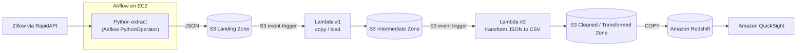
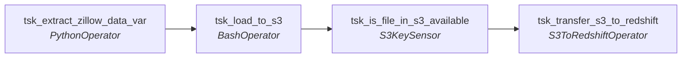

# Zillow End-to-End Data Pipeline (Airflow + AWS)

An orchestrated ELT pipeline that pulls Zillow listing data from RapidAPI, lands it in S3, cleans it with AWS Lambda, loads it into Amazon Redshift, and serves it to QuickSight. Apache Airflow runs on an EC2 instance and orchestrates the flow.

## Architecture



## Airflow DAG: `zillow_analytics_dag`



| Task | Operator | What it does |
|---|---|---|
| `tsk_extract_zillow_data_var` | `PythonOperator` | Calls the Zillow API, writes the raw JSON to disk, and pushes the file path and expected CSV key to XCom |
| `tsk_load_to_s3` | `BashOperator` | `aws s3 mv` the JSON into the landing bucket, which triggers the Lambda chain |
| `tsk_is_file_in_s3_available` | `S3KeySensor` | Waits (reschedule mode) until the cleaned CSV appears in the cleaned bucket |
| `tsk_transfer_s3_to_redshift` | `S3ToRedshiftOperator` | `COPY`s the CSV into the Redshift table |

Schedule: `@daily`, `catchup=False`, `max_active_runs=1`.

## Repository layout

```
.
├── dags/
│   └── zillow_analytics_dag.py
├── lambdas/                 # Lambda functions (copy + transform), deployed separately
└── README.md
```

## Prerequisites

- Python 3.9+ and Apache Airflow 2.4+ (tested pattern: Airflow on an EC2 instance)
- `apache-airflow-providers-amazon`
- AWS CLI configured on the Airflow host (used by `tsk_load_to_s3`)
- A RapidAPI key subscribed to the Zillow API
- Three S3 buckets (landing, intermediate, cleaned) with S3 event triggers wired to the Lambda functions
- A Redshift cluster/workgroup and a target table whose columns match the CSV, plus an IAM role allowing Redshift to read the cleaned bucket

## Airflow setup on EC2

### 1. Launch the instance

In the EC2 console (pick your region, e.g. `us-west-2` / Oregon):

| Setting | Value |
|---|---|
| Name | `ec2-airflow-zillow` |
| AMI | Ubuntu (24.04 ships Python 3.12) |
| Instance type | `t2.medium` (Airflow needs more than 1 GB RAM) |
| Key pair | Create or select one (needed for SSH) |
| Firewall | Allow SSH (port 22) from **My IP** |

Launch, then select the instance and click **Connect**.

### 2. Install dependencies

```bash
sudo apt update
sudo apt install -y python3.12-venv awscli   # or install AWS CLI v2 from AWS docs

python3.12 -m venv airflow_venv
source airflow_venv/bin/activate

# Pin a tested Airflow 2.x version and use the official constraints file
AIRFLOW_VERSION=2.10.5
PYTHON_VERSION="$(python --version | cut -d ' ' -f 2 | cut -d '.' -f 1-2)"
pip install "apache-airflow==${AIRFLOW_VERSION}" \
  --constraint "https://raw.githubusercontent.com/apache/airflow/constraints-${AIRFLOW_VERSION}/constraints-${PYTHON_VERSION}.txt"
pip install apache-airflow-providers-amazon
```

### 3. AWS credentials

Preferred: attach an **IAM instance profile** to the EC2 instance with S3 (and Redshift COPY) permissions. No keys are stored on the box.

Fallback: run `aws configure` and enter the access key, secret key, and region. Never commit these.

### 4. Start Airflow

```bash
source airflow_venv/bin/activate
airflow standalone          # dev/test only; prints the admin username and password
```

To keep it running after you close SSH:

```bash
nohup airflow standalone > airflow.log 2>&1 &
```

### 5. Open the UI

1. EC2 → Instance → **Security** tab → click the **security group** link
2. **Inbound rules** → **Edit inbound rules** → **Add rule**
3. Type: **Custom TCP**, Port: **8080**, Source: **My IP**
4. Browse to `http://<public-IPv4-address>:8080` and log in with the credentials printed by `airflow standalone`

> Do not open port 8080 to `0.0.0.0/0`. For production, use a proper executor, a metadata DB such as Postgres, and put the UI behind HTTPS.

## Airflow setup on EC2

### 1. Launch the instance

- AMI: **Ubuntu 22.04 LTS** (default login user is `ubuntu`)
- Type: `t2.medium` or larger (Airflow struggles on 1 GB RAM)
- Security group: allow inbound **22** (SSH) and **8080** (Airflow UI) from your IP only
- IAM instance profile with access to the three S3 buckets and Redshift (preferred over static keys)

```bash
ssh -i your-key.pem ubuntu@<EC2_PUBLIC_DNS>
```

### 2. Install system dependencies

```bash
sudo apt update && sudo apt upgrade -y
sudo apt install -y python3-pip python3-venv unzip

# AWS CLI v2 (used by tsk_load_to_s3)
curl "https://awscli.amazonaws.com/awscli-exe-linux-x86_64.zip" -o awscliv2.zip
unzip awscliv2.zip && sudo ./aws/install
aws --version
```

### 3. Create a virtualenv and install Airflow

```bash
python3 -m venv ~/airflow_venv
source ~/airflow_venv/bin/activate

AIRFLOW_VERSION=2.9.3
PYTHON_VERSION="$(python3 --version | cut -d ' ' -f 2 | cut -d '.' -f 1-2)"
CONSTRAINT_URL="https://raw.githubusercontent.com/apache/airflow/constraints-${AIRFLOW_VERSION}/constraints-${PYTHON_VERSION}.txt"

pip install --upgrade pip
pip install "apache-airflow==${AIRFLOW_VERSION}" --constraint "${CONSTRAINT_URL}"
pip install apache-airflow-providers-amazon requests --constraint "${CONSTRAINT_URL}"
```

### 4. Initialise Airflow

```bash
export AIRFLOW_HOME=~/airflow
echo 'export AIRFLOW_HOME=~/airflow' >> ~/.bashrc

airflow db migrate

airflow users create \
  --username admin --password '<choose-a-password>' \
  --firstname Admin --lastname User \
  --role Admin --email you@example.com
```

Optional but recommended: in `~/airflow/airflow.cfg` set `load_examples = False` to hide the example DAGs.

### 5. Start the services

```bash
airflow standalone
```

### 6. Deploy the DAG

```bash
mkdir -p ~/airflow/dags
cp dags/zillow_analytics_dag.py ~/airflow/dags/
airflow dags list | grep zillow
airflow dags list-import-errors
```

## Configuration

**Airflow Variable** (keeps the API key out of the code):

```bash
airflow variables set zillow_api_headers \
  '{"X-RapidAPI-Key": "<key>", "X-RapidAPI-Host": "zillow56.p.rapidapi.com"}'
```

**Airflow Connections:**

```bash
# AWS (leave out keys to use the EC2 instance profile)
airflow connections add aws_s3_conn \
  --conn-type aws \
  --conn-extra '{"region_name": "us-east-1"}'

# Redshift
airflow connections add conn_id_redshift \
  --conn-type redshift \
  --conn-host <cluster>.<id>.<region>.redshift.amazonaws.com \
  --conn-port 5439 \
  --conn-login <user> \
  --conn-password '<password>' \
  --conn-schema <database>
```

**Environment variables** (set before starting Airflow, in the shell or the systemd unit):

```bash
export OUTPUT_DIR=/tmp/zillow
export LANDING_BUCKET=<your-landing-bucket>
export CLEANED_BUCKET=<your-cleaned-bucket>
export REDSHIFT_SCHEMA=public
export REDSHIFT_TABLE=zillow_data
```

All settings are optional and default to the values below:

| Variable | Default | Purpose |
|---|---|---|
| `ZILLOW_API_URL` | `https://zillow56.p.rapidapi.com/search` | API endpoint |
| `ZILLOW_LOCATION` | `houston, tx` | Search location |
| `OUTPUT_DIR` | `/home/ubuntu` | Local dir for raw JSON |
| `LANDING_BUCKET` | `my-landing-zone-bucket` | Raw JSON destination |
| `CLEANED_BUCKET` | `cleaned-data-zone-csv-bucket` | Lambda output (CSV) |
| `REDSHIFT_SCHEMA` / `REDSHIFT_TABLE` | `public` / `zillow_data` | Target table |
| `AWS_CONN_ID` / `REDSHIFT_CONN_ID` | `aws_s3_conn` / `conn_id_redshift` | Airflow connection ids |

## Run

```bash
source ~/airflow_venv/bin/activate

# Smoke-test a single task without the scheduler
airflow tasks test zillow_analytics_dag tsk_extract_zillow_data_var 2026-10-07

# Unpause and trigger a full run
airflow dags unpause zillow_analytics_dag
airflow dags trigger zillow_analytics_dag

# Check status
airflow dags list-runs -d zillow_analytics_dag
```

Logs are in the UI (Grid view, click a task, then Logs) or under `~/airflow/logs/`.

## Troubleshooting

| Symptom | Likely cause |
|---|---|
| DAG missing in UI | Import error: run `airflow dags list-import-errors` |
| `Variable zillow_api_headers does not exist` | Variable not set (see Configuration) |
| `aws: command not found` in `tsk_load_to_s3` | AWS CLI not on the scheduler's `PATH` |
| `AccessDenied` on S3 | Instance profile or connection lacks bucket permissions |
| Sensor times out | Lambda did not write the CSV to the cleaned bucket: check CloudWatch logs |
| Redshift `COPY` fails | Table missing or columns do not match the CSV; check `stl_load_errors` |

